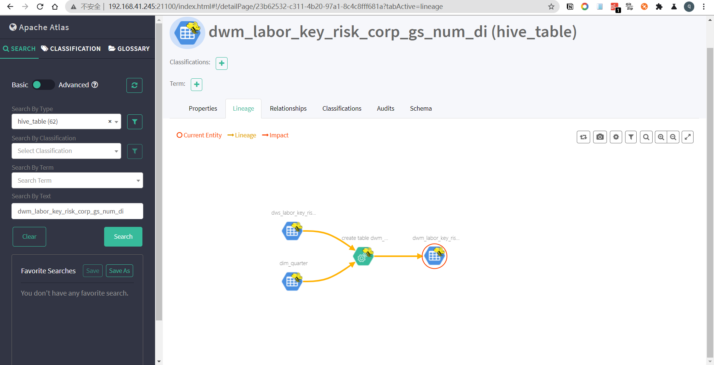

# CDH6集成Atlas

参考文档：[http://jiezhi.github.io/2020/03/31/atlas2-cdh6-hive-hook/](http://jiezhi.github.io/2020/03/31/atlas2-cdh6-hive-hook/)

官方地址：[https://atlas.apache.org/](https://atlas.apache.org/)

官方快速入门地址：[https://atlas.apache.org/\#/QuickStart](https://atlas.apache.org/#/QuickStart)

开发环境地址：[http://192.168.41.245:21100/](http://192.168.41.245:21100/) admin/admin

\[TOC\]

## 1.Atlas简介

**Atlas是什么？**

Apache Atlas是Hadoop社区为解决Hadoop生态系统的元数据治理问题而产生的开源项目，它为Hadoop集群提供了包括数据分类、集中策略引擎、数据血缘、安全和生命周期管理在内的元数据治理核心功能。


Atlas支持各种Hadoop和非Hadoop元数据类型，提供了丰富的Rest Api进行集成，对数据血缘的追溯达到了字段级别，对权限也有很好的控制。

**Atlas的架构原理：**


Atlas的组件可以分为以下主要类别：

### Core

Atlas核心包括以下组件：

**类型系统**：Atlas允许用户为他们要管理的元数据对象定义模型。该模型由称为“类型”的定义组成。称为“实体”的“类型”的实例表示受管理的实际元数据对象。类型系统是允许用户定义和管理类型和实体的组件。开箱即用的Atlas管理的所有元数据对象（例如，像Hive表）都使用类型进行建模，并表示为实体。为了在Atlas中存储新类型的元数据，需要了解类型系统组件的概念。

需要注意的一个关键点是，Atlas中建模的一般性质允许数据管理员和集成商定义技术元数据和业务元数据。也可以使用Atlas的功能在两者之间定义丰富的关系。

**Graph Engine**：在内部，Atlas会保留使用Graph模型管理的元数据对象。这种方法提供了极大的灵活性，并可以有效处理元数据对象之间的丰富关系。图引擎组件负责在Atlas类型系统的类型和实体以及基础图持久性模型之间进行转换。除了管理图形对象外，图形引擎还为元数据对象创建适当的索引，以便可以高效地搜索它们。Atlas使用JanusGraph存储元数据对象。

**提取/导出**：“提取”组件允许将元数据添加到Atlas。同样，导出组件将Atlas检测到的元数据更改公开为事件。消费者可以使用这些更改事件来实时响应元数据更改。

### Integration

用户可以使用两种方法在Atlas中管理元数据：

**API**：Atlas的所有功能都通过REST API向最终用户公开，该API允许创建，更新和删除类型和实体。它也是查询和发现Atlas管理的类型和实体的主要机制。

**消息传递**：除了API之外，用户还可以选择使用基于Kafka的消息传递接口与Atlas集成。这对于将元数据对象传达给Atlas以及从Atlas消耗可用于构建应用程序的元数据更改事件都很有用。如果有人希望使用与Atlas的松散耦合集成，从而可以实现更好的可伸缩性，可靠性等，则该消息传递接口特别有用。Atlas使用Apache Kafka作为通知服务器，用于挂钩和元数据通知事件的下游使用者之间的通信。这些事件由钩子和Atlas编写，涉及不同的Kafka主题。

### 元数据源

Atlas支持与许多现成的元数据源集成。将来还将添加更多集成。当前，Atlas支持从以下来源提取和管理元数据：

* [HBase](https://atlas.apache.org/#/HookHBase)
* [hive](https://atlas.apache.org/#/HookHive)
* [Sqoop](https://atlas.apache.org/#/HookSqoop)
* [Storm](https://atlas.apache.org/#/HookStorm)
* [Kafka](https://atlas.apache.org/#/HookKafka)

集成意味着两件事：Atlas原生定义了一些元数据模型来表示这些组件的对象。Atlas提供了一些组件以从这些组件（实时或在某些情况下为批处理模式）中提取元数据对象。

### Applications

Atlas管理的元数据被各种应用程序使用，以满足许多治理用例。

**Atlas Admin UI**：此组件是一个基于Web的应用程序，允许数据管理员和科学家发现和注释元数据。这里最重要的是搜索界面和类似SQL的查询语言，可用于查询Atlas管理的元数据类型和对象。管理员界面使用Atlas的REST API来构建其功能。

**基于标签的策略**：[Apache Ranger](http://ranger.apache.org/)是针对Hadoop生态系统的高级安全管理解决方案，与各种Hadoop组件广泛集成。通过与Atlas集成，Ranger使安全管理员可以定义元数据驱动的安全策略，以进行有效的管理。Ranger是Atlas通知的元数据更改事件的使用者。

## 2.常见报错

### .1 编译报错

```text
Failed to execute goal org.apache.maven.plugins:maven-enforcer-plugin:3.0.0-M1:enforce (enforce-versions) on project apache-atlas: Some Enforcer rules have failed. Look above for specific messages explaining why the rule failed. -> [Help 1]
```

详细报错内容：

```text
[INFO] apache-atlas ...................................... FAILURE [1.595s]
[INFO] Apache Atlas Test Utility Tools ................... SKIPPED
[INFO] Apache Atlas Integration .......................... SKIPPED
[INFO] Apache Atlas Common ............................... SKIPPED
[INFO] Apache Atlas Client ............................... SKIPPED
[INFO] atlas-client-common ............................... SKIPPED
[INFO] atlas-client-v1 ................................... SKIPPED
[INFO] Apache Atlas Server API ........................... SKIPPED
[INFO] Apache Atlas Notification ......................... SKIPPED
[INFO] atlas-client-v2 ................................... SKIPPED
[INFO] Apache Atlas Graph Database Projects .............. SKIPPED
[INFO] Apache Atlas Graph Database API ................... SKIPPED
[INFO] Graph Database Common Code ........................ SKIPPED
[INFO] Apache Atlas JanusGraph-HBase2 Module ............. SKIPPED
[INFO] Apache Atlas JanusGraph DB Impl ................... SKIPPED
[INFO] Apache Atlas Graph Database Implementation Dependencies  SKIPPED
[INFO] Apache Atlas Authorization ........................ SKIPPED
[INFO] Apache Atlas Repository ........................... SKIPPED
[INFO] Apache Atlas UI ................................... SKIPPED
[INFO] Apache Atlas Web Application ...................... SKIPPED
[INFO] Apache Atlas Documentation ........................ SKIPPED
[INFO] Apache Atlas FileSystem Model ..................... SKIPPED
[INFO] Apache Atlas Plugin Classloader ................... SKIPPED
[INFO] Apache Atlas Hive Bridge Shim ..................... SKIPPED
[INFO] Apache Atlas Hive Bridge .......................... SKIPPED
[INFO] Apache Atlas Falcon Bridge Shim ................... SKIPPED
[INFO] Apache Atlas Falcon Bridge ........................ SKIPPED
[INFO] Apache Atlas Sqoop Bridge Shim .................... SKIPPED
[INFO] Apache Atlas Sqoop Bridge ......................... SKIPPED
[INFO] Apache Atlas Storm Bridge Shim .................... SKIPPED
[INFO] Apache Atlas Storm Bridge ......................... SKIPPED
[INFO] Apache Atlas Hbase Bridge Shim .................... SKIPPED
[INFO] Apache Atlas Hbase Bridge ......................... SKIPPED
[INFO] Apache HBase - Testing Util ....................... SKIPPED
[INFO] Apache Atlas Kafka Bridge ......................... SKIPPED
[INFO] Apache Atlas Distribution ......................... SKIPPED
[INFO] ------------------------------------------------------------------------
[INFO] BUILD FAILURE
[INFO] ------------------------------------------------------------------------
[INFO] Total time: 5.887s
[INFO] Finished at: Wed Dec 30 16:04:36 CST 2020
[INFO] Final Memory: 39M/1963M
[INFO] ------------------------------------------------------------------------
[ERROR] Failed to execute goal org.apache.maven.plugins:maven-enforcer-plugin:3.0.0-M1:enforce (enforce-versions) on project apache-atlas: Some Enforcer rules have failed. Look above for specific messages explaining why the rule failed. -> [Help 1]
[ERROR]
[ERROR] To see the full stack trace of the errors, re-run Maven with the -e switch.
[ERROR] Re-run Maven using the -X switch to enable full debug logging.
[ERROR]
[ERROR] For more information about the errors and possible solutions, please read the following articles:
[ERROR] [Help 1] http://cwiki.apache.org/confluence/display/MAVEN/MojoExecutionException
[ERROR]
[ERROR] After correcting the problems, you can resume the build with the command
[ERROR]   mvn <goals> -rf :apache-atlas
[root@bigdata244 apache-atlas-sources-2.0.0]#
```

解决方案:

更新pom中的maven版本或者更新本地的maven版本

### .2  编译Apache Atlas JanusGraph DB Impl失败

```text
[ERROR] Failed to execute goal org.apache.maven.plugins:maven-remote-resources-plugin:1.5:process (default) on project atlas-graphdb-janus: Error resolving project artifact: Could not transfer artifact com.sleepycat:je:pom:7.4.5 from/to central (http://repo1.maven.org/maven2): Failed to transfer file: http://repo1.maven.org/maven2/com/sleepycat/je/7.4.5/je-7.4.5.pom. Return code is: 501, ReasonPhrase: HTTPS Required. for project com.sleepycat:je:jar:7.4.5 -> [Help 1]
```

解决方案:

pom.xml添加repository配置

```markup
<repository>
    <id>oracleReleases</id>
    <name>Oracle Released Java Packages</name>
    <url>http://download.oracle.com/maven</url>
    <layout>default</layout>
</repository>
```

### .3 编译Apache Atlas Web Application 失败

```text
[ERROR] Failed to execute goal on project atlas-webapp: Could not resolve dependencies for project org.apache.atlas:atlas-webapp:war:2.0.0: The following artifacts could not be resolved: io.netty:netty:jar:3.10.5.Final, io.netty:netty-all:jar:4.0.52.Final, com.google.inject.extensions:guice-throwingproviders:jar:4.1.0, org.eclipse.jetty:jetty-jsp:jar:9.2.12.v20150709, org.eclipse.jetty.orbit:org.eclipse.jdt.core:jar:3.8.2.v20130121, org.aspectj:aspectjrt:jar:1.8.9, org.aspectj:aspectjweaver:jar:1.8.9, org.easymock:easymock:jar:3.4, org.objenesis:objenesis:jar:2.2, com.nimbusds:nimbus-jose-jwt:jar:5.4, com.webcohesion.enunciate:enunciate-core-annotations:jar:2.11.1, org.kohsuke:libpam4j:jar:1.8, com.amazonaws:aws-java-sdk-bundle:jar:1.11.271: Could not transfer artifact io.netty:netty:jar:3.10.5.Final from/to central (http://repo1.maven.org/maven2): Failed to transfer file: http://repo1.maven.org/maven2/io/netty/netty/3.10.5.Final/netty-3.10.5.Final.jar. Return code is: 501 , ReasonPhrase:HTTPS Required. -> [Help 1]
```

解决方案:

```markup
<repository>
    <id>alimaven</id>
    <name>aliyun maven</name>
    <url>http://maven.aliyun.com/nexus/content/groups/public/</url>
</repository>
```

### .4 编译Apache Atlas Documentation失败

```text
[ERROR] Failed to execute goal org.apache.maven.plugins:maven-site-plugin:3.7:site (default) on project atlas-docs: SiteToolException: The site descriptor cannot be resolved from the repository: ArtifactResolutionException: Unable to locate site descriptor: Could not transfer artifact org.apache:apache:xml:site_en:17 from/to central (http://repo1.maven.org/maven2): Failed to transfer file: http://repo1.maven.org/maven2/org/apache/apache/17/apache-17-site_en.xml. Return code is: 501 , ReasonPhrase:HTTPS Required.
[ERROR]   org.apache:apache:xml:17
[ERROR] 
[ERROR] from the specified remote repositories:
[ERROR]   central (http://repo1.maven.org/maven2, releases=true, snapshots=false),
[ERROR]   hortonworks.repo (http://repo.hortonworks.com/content/repositories/releases, releases=true, snapshots=false),
[ERROR]   apache.snapshots.repo (https://repository.apache.org/content/groups/snapshots, releases=true, snapshots=true),
[ERROR]   apache-staging (https://repository.apache.org/content/groups/staging/, releases=true, snapshots=true),
[ERROR]   default (https://repository.apache.org/content/groups/public/, releases=true, snapshots=true),
[ERROR]   java.net-Public (https://maven.java.net/content/groups/public/, releases=true, snapshots=true),
[ERROR]   repository.jboss.org-public (https://repository.jboss.org/nexus/content/groups/public, releases=true, snapshots=true),
[ERROR]   typesafe (http://repo.typesafe.com/typesafe/releases/, releases=true, snapshots=true),
[ERROR]   alimaven (http://maven.aliyun.com/nexus/content/groups/public/, releases=true, snapshots=true),
[ERROR]   oracleReleases (http://download.oracle.com/maven, releases=true, snapshots=true),
[ERROR]   apache.snapshots (http://repository.apache.org/snapshots, releases=false, snapshots=true)
[ERROR] 
[ERROR] -> [Help 1]
[ERROR] 
[ERROR] To see the full stack trace of the errors, re-run Maven with the -e switch.
[ERROR] Re-run Maven using the -X switch to enable full debug logging.
[ERROR] 
[ERROR] For more information about the errors and possible solutions, please read the following articles:
[ERROR] [Help 1] http://cwiki.apache.org/confluence/display/MAVEN/MojoExecutionException
[ERROR] 
[ERROR] After correcting the problems, you can resume the build with the command
[ERROR]   mvn <goals> -rf :atlas-docs
```

解决方案：

/root/.m2/settings.xml mirrors下增加新的mirror

```markup
<mirror> 
      <id>alimaven</id> 
      <name>aliyun maven</name> 
      <url>http://maven.aliyun.com/nexus/content/repositories/central/</url> 
      <mirrorOf>central</mirrorOf> 
</mirror>
```

pom.xml中修改typesafe的url

```markup
<repository>
    <id>typesafe</id>
    <name>Typesafe Repository</name>
    <!-- 原始的内容注释掉
    <url>https://repo.typesafe.com/typesafe/releases/</url>
    -->
    <!--将url修改成下方地址-->
    <url>http://dl.bintray.com/typesafe</url>
</repository>
```

### .5 编译dashboardV2卡住

apache atlas配置需要用到node和npm，这两个资源也需要外网下载，多次下载都不成功，也需要改成国内资源。问题由于npm的下载源在国外，所以可以换成淘宝的

```markup
<configuration>
    <nodeVersion>${node-for-v2.version}</nodeVersion>
    <npmVersion>${npm-for-v2.version}</npmVersion>
    <!--下边两行是追加的-->
    <nodeDownloadRoot>https://npm.taobao.org/mirrors/node/</nodeDownloadRoot>         <npmDownloadRoot>https://registry.npm.taobao.org/npm/-/</npmDownloadRoot>
</configuration>
```

### .6 Atlas启动报错

报错明细：

```text
[root@bigdata245 bin]# ./atlas_start.py
Exception: ('Could not find hbase-site.xml in %s. Please set env var HBASE_CONF_DIR to the hbase client conf dir', '/opt/atlas/hbase/conf')
Traceback (most recent call last):
  File "./atlas_start.py", line 163, in <module>
    returncode = main()
  File "./atlas_start.py", line 92, in main
    raise Exception("Could not find hbase-site.xml in %s. Please set env var HBASE_CONF_DIR to the hbase client conf dir", hbase_conf_dir)
Exception: ('Could not find hbase-site.xml in %s. Please set env var HBASE_CONF_DIR to the hbase client conf dir', '/opt/atlas/hbase/conf')
```

解决方案：

缺少HBase的环境变量

```text
vi /etc/profile

#HBASE_HOME
export HBASE_HOME=/opt/cloudera/parcels/CDH/lib/hbase
export HBASE_CONF_DIR=/etc/hbase/conf
export PATH=$HBASE_HOME/bin:$PATH

:wq!

source /etc/profile
```

### .7 hive报错

```text
Exception in thread "main" java.lang.ExceptionInInitializerError
        at java.lang.Class.forName0(Native Method)
        at java.lang.Class.forName(Class.java:348)
        at org.apache.hadoop.hive.ql.hooks.HooksLoader.getHooks(HooksLoader.java:103)
        at org.apache.hadoop.hive.ql.hooks.HooksLoader.getHooks(HooksLoader.java:64)
        at org.apache.hadoop.hive.ql.Driver.execute(Driver.java:1956)
        at org.apache.hadoop.hive.ql.Driver.runInternal(Driver.java:1563)
        at org.apache.hadoop.hive.ql.Driver.run(Driver.java:1339)
        at org.apache.hadoop.hive.ql.Driver.run(Driver.java:1328)
        at org.apache.hadoop.hive.cli.CliDriver.processLocalCmd(CliDriver.java:239)
        at org.apache.hadoop.hive.cli.CliDriver.processCmd(CliDriver.java:187)
        at org.apache.hadoop.hive.cli.CliDriver.processLine(CliDriver.java:409)
        at org.apache.hadoop.hive.cli.CliDriver.executeDriver(CliDriver.java:836)
        at org.apache.hadoop.hive.cli.CliDriver.run(CliDriver.java:772)
        at org.apache.hadoop.hive.cli.CliDriver.main(CliDriver.java:699)
        at sun.reflect.NativeMethodAccessorImpl.invoke0(Native Method)
        at sun.reflect.NativeMethodAccessorImpl.invoke(NativeMethodAccessorImpl.java:62)
        at sun.reflect.DelegatingMethodAccessorImpl.invoke(DelegatingMethodAccessorImpl.java:43)
        at java.lang.reflect.Method.invoke(Method.java:498)
        at org.apache.hadoop.util.RunJar.run(RunJar.java:313)
        at org.apache.hadoop.util.RunJar.main(RunJar.java:227)
Caused by: java.lang.NullPointerException
        at org.apache.atlas.hook.AtlasHook.<clinit>(AtlasHook.java:81)
        ... 20 more
```

## 3.前置环境准备

搭建Atlas之前需要有相关的hadoop生态组件

* CDH集群

\(hdfs,yarn,zookeeper,hive,hbase,impala,sqoop,spark,flume,kafka,solr,hue\)

已经配置过环境变量

```text
#HIVE_HOME
export HIVE_HOME=/opt/cloudera/parcels/CDH/lib/hive
export HIVE_CONF_DIR=/etc/hive/conf
export PATH=$HIVE_HOME/bin:$PATH
#HBASE_HOME
export HBASE_HOME=/opt/cloudera/parcels/CDH/lib/hbase
export HBASE_CONF_DIR=/etc/hbase/conf
export PATH=$HBASE_HOME/bin:$PATH
#HADOOP_HOME
export HADOOP_HOME=/opt/cloudera/parcels/CDH/lib/hadoop/
```

* maven

\(已配置aliyun镜像\)

```markup
<mirror> 
      <id>alimaven</id> 
      <name>aliyun maven</name> 
      <url>http://maven.aliyun.com/nexus/content/repositories/central/</url> 
      <mirrorOf>central</mirrorOf> 
</mirror>
```

### .1 物理环境

实验环境 : 192.168.41.245

### .2 版本选择

20200818 Updated: 目前最新版是2.1.0，如果 Hive 版本是3.1一下的，可能存在不兼容问题。

目前选取Atlas 2.0.0

### .3  Atlas 2.0下载 : [Download](https://atlas.apache.org/#/Downloads)

| **Version** | **Release Date** | **Tarball** | **GPG** | **Hash** |
| :--- | :--- | :--- | :--- | :--- |
| 2.1.0 | 2020-07-15 | [source](https://www.apache.org/dyn/closer.cgi/atlas/2.1.0/apache-atlas-2.1.0-sources.tar.gz) | [signature](https://www.apache.org/dist/atlas/2.1.0/apache-atlas-2.1.0-sources.tar.gz.asc) | [SHA512](https://www.apache.org/dist/atlas/2.1.0/apache-atlas-2.1.0-sources.tar.gz.sha512) |
| 0.8.4 | 2019-06-21 | [source](https://www.apache.org/dyn/closer.cgi/atlas/0.8.4/apache-atlas-0.8.4-sources.tar.gz) | [signature](https://www.apache.org/dist/atlas/0.8.4/apache-atlas-0.8.4-sources.tar.gz.asc) | [SHA512](https://www.apache.org/dist/atlas/0.8.4/apache-atlas-0.8.4-sources.tar.gz.sha512) |
| 1.2.0 | 2019-06-07 | [source](https://www.apache.org/dyn/closer.cgi/atlas/1.2.0/apache-atlas-1.2.0-sources.tar.gz) | [signature](https://www.apache.org/dist/atlas/1.2.0/apache-atlas-1.2.0-sources.tar.gz.asc) | [SHA512](https://www.apache.org/dist/atlas/1.2.0/apache-atlas-1.2.0-sources.tar.gz.sha512) |
| 2.0.0 | 2019-05-13 | [source](https://archive.apache.org/dist/atlas/2.0.0/apache-atlas-2.0.0-sources.tar.gz) | [signature](https://archive.apache.org/dist/atlas/2.0.0/apache-atlas-2.0.0-sources.tar.gz.asc) | [SHA512](https://archive.apache.org/dist/atlas/2.0.0/apache-atlas-2.0.0-sources.tar.gz.sha512) |
| 0.8.3 | 2018-10-31 | [source](https://archive.apache.org/dist/atlas/0.8.3/apache-atlas-0.8.3-sources.tar.gz) | [signature](https://archive.apache.org/dist/atlas/0.8.3/apache-atlas-0.8.3-sources.tar.gz.asc) | [SHA512](https://archive.apache.org/dist/atlas/0.8.3/apache-atlas-0.8.3-sources.tar.gz.sha512) |
| 1.1.0 | 2018-09-14 | [source](https://archive.apache.org/dist/atlas/1.1.0/apache-atlas-1.1.0-sources.tar.gz) | [signature](https://archive.apache.org/dist/atlas/1.1.0/apache-atlas-1.1.0-sources.tar.gz.asc) | [SHA512](https://archive.apache.org/dist/atlas/1.1.0/apache-atlas-1.1.0-sources.tar.gz.sha512) |
| 1.0.0 | 2018-06-02 | [source](https://archive.apache.org/dist/atlas/1.0.0/apache-atlas-1.0.0-sources.tar.gz) | [signature](https://archive.apache.org/dist/atlas/1.0.0/apache-atlas-1.0.0-sources.tar.gz.asc) | [SHA512](https://archive.apache.org/dist/atlas/1.0.0/apache-atlas-1.0.0-sources.tar.gz.sha512) |
| 0.8.2 | 2018-02-05 | [source](https://archive.apache.org/dist/atlas/0.8.2/apache-atlas-0.8.2-sources.tar.gz) | [signature](https://archive.apache.org/dist/atlas/0.8.2/apache-atlas-0.8.2-sources.tar.gz.asc) | [SHA512](https://archive.apache.org/dist/atlas/0.8.2/apache-atlas-0.8.2-sources.tar.gz.sha512) |
| 0.8.1 | 2017-08-29 | [source](https://archive.apache.org/dist/atlas/0.8.1/apache-atlas-0.8.1-sources.tar.gz) | [signature](https://archive.apache.org/dist/atlas/0.8.1/apache-atlas-0.8.1-sources.tar.gz.asc) | [SHA512](https://archive.apache.org/dist/atlas/0.8.1/apache-atlas-0.8.1-sources.tar.gz.sha512) |
| 0.7.0-incubating | 2016-07-09 | [source](https://archive.apache.org/dist/atlas/0.7.0-incubating/apache-atlas-0.7-incubating-sources.tar.gz) | [signature](https://archive.apache.org/dist/atlas/0.7.0-incubating/apache-atlas-0.7-incubating-sources.tar.gz.asc) | [SHA512](https://archive.apache.org/dist/atlas/0.7.0-incubating/apache-atlas-0.7-incubating-sources.tar.gz.sha512) |
| 0.8.0-incubating | 2017-06-26 | [source](https://archive.apache.org/dist/atlas/0.8.0-incubating/apache-atlas-0.8-incubating-sources.tar.gz) | [signature](https://archive.apache.org/dist/atlas/0.8.0-incubating/apache-atlas-0.8-incubating-sources.tar.gz.asc) | [SHA512](https://archive.apache.org/dist/atlas/0.8.0-incubating/apache-atlas-0.8-incubating-sources.tar.gz.sha512) |
| 0.7.1-incubating | 2017-01-28 | [source](https://archive.apache.org/dist/atlas/0.7.1-incubating/apache-atlas-0.7.1-incubating-sources.tar.gz) | [signature](https://archive.apache.org/dist/atlas/0.7.1-incubating/apache-atlas-0.7.1-incubating-sources.tar.gz.asc) | [checksum](https://archive.apache.org/dist/atlas/0.7.1-incubating/apache-atlas-0.7.1-incubating-sources.tar.gz.mds) |
| 0.6.0-incubating | 2015-12-31 | [source](https://archive.apache.org/dist/atlas/0.6.0-incubating/apache-atlas-0.6-incubating-sources.tar.gz) | [signature](https://archive.apache.org/dist/atlas/0.6.0-incubating/apache-atlas-0.6-incubating-sources.tar.gz.asc) | [SHA](https://archive.apache.org/dist/atlas/0.6.0-incubating/apache-atlas-0.6-incubating-sources.tar.gz.sha) |
| 0.5.0-incubating | 2015-07-10 | [source](https://archive.apache.org/dist/atlas/0.5.0-incubating/apache-atlas-0.5-incubating-sources.tar.gz) | [signature](https://archive.apache.org/dist/atlas/0.5.0-incubating/apache-atlas-0.5-incubating-sources.tar.gz.asc) | [SHA](https://archive.apache.org/dist/atlas/0.5.0-incubating/apache-atlas-0.5-incubating-sources.tar.gz.sha) |

### .2 编译

从官网下载Atlas 2.0的代码，然后进行编译，详见官网（基本没啥坑，除非 maven 版本太低，去下一个最新的即可）

```text
tar xvfz apache-atlas-2.0.0-sources.tar.gz
cd apache-atlas-sources-2.0.0/
export MAVEN_OPTS="-Xms2g -Xmx2g"
mvn clean -DskipTests install
#Total time: 22:05 min
#[INFO] Finished at: 2020-12-31T11:29:23+08:00
#[INFO] Final Memory: 391M/1789M
# 下载周期比较长要耐心等待,如果出现编译不通过等情况请参照"3.常见报错"
mvn clean -DskipTests package -Pdist
```

编译好的位置在`distro/target/`下

```text
总用量 755252
drwxr-xr-x. 3 root root        32 12月 31 11:50 apache-atlas-2.0.0-bin
-rw-r--r--. 1 root root 376484893 12月 31 11:50 apache-atlas-2.0.0-bin.tar.gz
drwxr-xr-x. 3 root root        44 12月 31 11:49 apache-atlas-2.0.0-falcon-hook
-rw-r--r--. 1 root root   9210138 12月 31 11:50 apache-atlas-2.0.0-falcon-hook.tar.gz
drwxr-xr-x. 3 root root        43 12月 31 11:49 apache-atlas-2.0.0-hbase-hook
-rw-r--r--. 1 root root  11079372 12月 31 11:49 apache-atlas-2.0.0-hbase-hook.tar.gz
drwxr-xr-x. 3 root root        42 12月 31 11:49 apache-atlas-2.0.0-hive-hook
-rw-r--r--. 1 root root  16266498 12月 31 11:49 apache-atlas-2.0.0-hive-hook.tar.gz
drwxr-xr-x. 3 root root        43 12月 31 11:50 apache-atlas-2.0.0-kafka-hook
-rw-r--r--. 1 root root   9215671 12月 31 11:50 apache-atlas-2.0.0-kafka-hook.tar.gz
drwxr-xr-x. 3 root root        32 12月 31 11:50 apache-atlas-2.0.0-server
-rw-r--r--. 1 root root 271835663 12月 31 11:50 apache-atlas-2.0.0-server.tar.gz
-rw-r--r--. 1 root root  11063024 12月 31 11:50 apache-atlas-2.0.0-sources.tar.gz
drwxr-xr-x. 3 root root        43 12月 31 11:49 apache-atlas-2.0.0-sqoop-hook
-rw-r--r--. 1 root root   9191784 12月 31 11:49 apache-atlas-2.0.0-sqoop-hook.tar.gz
drwxr-xr-x. 3 root root        43 12月 31 11:50 apache-atlas-2.0.0-storm-hook
-rw-r--r--. 1 root root  58904750 12月 31 11:50 apache-atlas-2.0.0-storm-hook.tar.gz
drwxr-xr-x. 2 root root         6 12月 31 11:49 archive-tmp
-rw-r--r--. 1 root root     97463 12月 31 11:49 atlas-distro-2.0.0.jar
drwxr-xr-x. 2 root root      4096 12月 31 11:49 bin
drwxr-xr-x. 5 root root       231 12月 31 11:49 conf
drwxr-xr-x. 2 root root        28 12月 31 11:49 maven-archiver
drwxr-xr-x. 3 root root        22 12月 31 11:49 maven-shared-archive-resources
drwxr-xr-x. 2 root root        55 12月 31 11:49 META-INF
-rw-r--r--. 1 root root      3698 12月 31 11:49 rat.txt
drwxr-xr-x. 3 root root        22 12月 31 11:49 test-classes
```

目前需要的基础包: apache-atlas-2.0.0-bin.tar.gz

需要 hook 的组件如：`apache-atlas-2.0.0-hive-hook.tar.gz`

直接解压到/opt/atlas下

## 4.安装

### .1 基础配置

**conf/atlas-application.properties**

配置以下几个部分

```text
graph TD

A[Hbase]
Solr
Kafka
Atlas_Server
Hive_Hook
```

```text
#Hbase
#For standalone mode , specify localhost
#for distributed mode, specify zookeeper quorum here
atlas.graph.storage.hostname=bigdata241:2181,bigdata244:2181,bigdata245:2181

#Solr
#Solr cloud mode properties
atlas.graph.index.search.solr.mode=cloud
atlas.graph.index.search.solr.zookeeper-url=bigdata241:2181/solr,bigdata244:2181/solr,bigdata245:2181/solr
atlas.graph.index.search.solr.zookeeper-connect-timeout=60000
atlas.graph.index.search.solr.zookeeper-session-timeout=60000
atlas.graph.index.search.solr.wait-searcher=true

#########  Notification Configs  #########
atlas.notification.embedded=false
atlas.kafka.data=${sys:atlas.home}/data/kafka
atlas.kafka.zookeeper.connect=bigdata241:2181,bigdata244:2181,bigdata245:2181
atlas.kafka.bootstrap.servers=bigdata243:9092,bigdata244:9092,bigdata245:9092
atlas.kafka.zookeeper.session.timeout.ms=400
atlas.kafka.zookeeper.connection.timeout.ms=200
atlas.kafka.zookeeper.sync.time.ms=20
atlas.kafka.auto.commit.interval.ms=1000
atlas.kafka.hook.group.id=atlas

## Server port configuration
atlas.server.http.port=21100
#atlas.server.https.port=21443

#########  Server Properties  #########
atlas.rest.address=http://bigdata245:21100
# If enabled and set to true, this will run setup steps when the server starts
#atlas.server.run.setup.on.start=false

#########  Entity Audit Configs  #########
atlas.audit.hbase.tablename=apache_atlas_entity_audit
atlas.audit.zookeeper.session.timeout.ms=1000
atlas.audit.hbase.zookeeper.quorum=bigdata241:2181,bigdata244:2181,bigdata245:2181


##追加
########## Hive Hook Configs ###########

atlas.hook.hive.synchronous=false
atlas.hook.hive.numRetries=3
atlas.hook.hive.queueSize=10000
atlas.cluster.name=primary
```

### .2 Hive Hook相关配置

* Jar包配置

  把配置复制到 hook/hive 下，然后打包进atlas-plugin-classloader-2.0.0.jar

  ```text
  zip -u atlas-plugin-classloader-2.0.0.jar atlas-application.properties
  ```

* CM 页面配置

**Hive 辅助 JAR 目录**

Hive（服务范围） /opt/atlas/hook/hive

**hive-site.xml 的 Hive 服务高级配置代码段（安全阀）**

```markup
<property>
    <name>hive.exec.post.hooks</name>                 
    <value>org.apache.atlas.hive.hook.HiveHook</value>
</property>
```

**hive-site.xml 的 Hive 客户端高级配置代码段（安全阀）**

Gateway Default Group

```markup
<property>
    <name>hive.exec.post.hooks</name>
    <value>org.apache.atlas.hive.hook.HiveHook</value>
</property>
```

**hive-site.xml 的 HiveServer2 高级配置代码段（安全阀）**

HiveServer2 Default Group

```markup
<property>
    <name>hive.server2.authentication</name>
    <value>CUSTOM</value>
</property>
<property>    
    <name>hive.server2.custom.authentication.class</name>
    <value>org.apache.hadoop.hive.contrib.auth.CustomPasswdAuthenticator</value>
</property>
<property>
    <name>hive.jdbc_passwd.auth.hive</name>
    <value>hive</value>
</property>
<property>
    <name>hive.server2.transport.mode</name>
    <value>binary</value>
</property>
<property>
    <name>hive.security.authorization.createtable.owner.grants</name><value>ALL</value>
</property>
<property>
    <name>hive.exec.post.hooks</name><value>org.apache.atlas.hive.hook.HiveHook</value>
</property>
<property>
    <name>hive.reloadable.aux.jars.path</name>
    <value>/opt/atlas/hook/hive</value>
</property>
```

**HiveServer2 环境高级配置代码段（安全阀）**

HiveServer2 Default Group

```text
HIVE_AUX_JARS_PATH=/opt/atlas/hook/hive
```

需要在集群中分发上述文件，即所有Hive节点都需要有HIVE\_AUX\_JARS\_PATH所指定的路径，该路径下必须包含/opt/atlas/hook/hive下的所有文件

**到此为止hive重启**

### .3 启动服务

```text
cd /opt/atlas/bin
## 启动服务
 ./atlas_start.py

# 账号密码 
admin/admin

# 关闭服务
./atlas_stop.py
```

### .4 历史数据导入

```text
cd /opt/atlas/bin

[root@bigdata245 bin]# ./import-hive.sh
Using Hive configuration directory [/etc/hive/conf]
Log file for import is /opt/atlas/logs/import-hive.log
SLF4J: Class path contains multiple SLF4J bindings.
SLF4J: Found binding in [jar:file:/opt/cloudera/parcels/CDH-6.3.2-1.cdh6.3.2.p0.1605554/jars/log4j-slf4j-impl-2.8.2.jar!/org/slf4j/impl/StaticLoggerBinder.class]
SLF4J: Found binding in [jar:file:/opt/cloudera/parcels/CDH-6.3.2-1.cdh6.3.2.p0.1605554/jars/slf4j-log4j12-1.7.25.jar!/org/slf4j/impl/StaticLoggerBinder.class]
SLF4J: See http://www.slf4j.org/codes.html#multiple_bindings for an explanation.
SLF4J: Actual binding is of type [org.apache.logging.slf4j.Log4jLoggerFactory]
ERROR StatusLogger No log4j2 configuration file found. Using default configuration: logging only errors to the console. Set system property 'org.apache.logging.log4j.simplelog.StatusLogger.level' to TRACE to show Log4j2 internal initialization logging.
Enter username for atlas :- admin
Enter password for atlas :-
Hive Meta Data imported successfully!!!
```

日志报错可以考虑自己放置一个log4j2配置文件在conf目录下，但是并不影响使用

## 5.应用场景

Atlas主要的应用场景:

**元数据类型和实例**

* 各种Hadoop和非Hadoop元数据的预定义类型
* 能够为要管理的元数据定义新类型
* 类型可以具有原始属性，复杂属性，对象引用；可以继承其他类型
* 类型的实例（称为实体）捕获元数据对象详细信息及其关系
* REST API与类型和实例一起使用，可以更轻松地集成

**分类**

* 动态创建分类的能力-如PII，EXPIRES\_ON，DATA\_QUALITY，SENSITIVE
* 分类可以包含属性-例如EXPIRES\_ON分类中的expiry\_date属性
* 实体可以与多种分类相关联，从而使发现和安全实施更加容易
* 通过沿袭传播分类-自动确保分类遵循数据经过各种处理的过程

**血统**

* 直观的UI，可查看数据沿各种流程移动的沿袭
* REST API访问和更新沿袭

**搜索/发现**

* 直观的用户界面，可按类型，分类，属性值或自由文本搜索实体
* 丰富的REST API，可通过复杂条件进行搜索
* 类似于SQL的查询语言以搜索实体-域特定语言（DSL）

**安全和数据屏蔽**

* 用于元数据访问的细粒度安全性，使您能够控制对实体实例的访问以及诸如添加/更新/删除分类的操作
* 与Apache Ranger的集成可基于与Apache Atlas中的实体相关联的分类对数据访问进行授权/数据屏蔽。例如：
  * 谁可以访问分类为PII，敏感的数据
  * 客户服务用户只能看到列为NATIONAL\_ID的列的最后4位数字

详细报错内容：

```text
[INFO] apache-atlas ...................................... FAILURE [1.595s]
[INFO] Apache Atlas Test Utility Tools ................... SKIPPED
[INFO] Apache Atlas Integration .......................... SKIPPED
[INFO] Apache Atlas Common ............................... SKIPPED
[INFO] Apache Atlas Client ............................... SKIPPED
[INFO] atlas-client-common ............................... SKIPPED
[INFO] atlas-client-v1 ................................... SKIPPED
[INFO] Apache Atlas Server API ........................... SKIPPED
[INFO] Apache Atlas Notification ......................... SKIPPED
[INFO] atlas-client-v2 ................................... SKIPPED
[INFO] Apache Atlas Graph Database Projects .............. SKIPPED
[INFO] Apache Atlas Graph Database API ................... SKIPPED
[INFO] Graph Database Common Code ........................ SKIPPED
[INFO] Apache Atlas JanusGraph-HBase2 Module ............. SKIPPED
[INFO] Apache Atlas JanusGraph DB Impl ................... SKIPPED
[INFO] Apache Atlas Graph Database Implementation Dependencies  SKIPPED
[INFO] Apache Atlas Authorization ........................ SKIPPED
[INFO] Apache Atlas Repository ........................... SKIPPED
[INFO] Apache Atlas UI ................................... SKIPPED
[INFO] Apache Atlas Web Application ...................... SKIPPED
[INFO] Apache Atlas Documentation ........................ SKIPPED
[INFO] Apache Atlas FileSystem Model ..................... SKIPPED
[INFO] Apache Atlas Plugin Classloader ................... SKIPPED
[INFO] Apache Atlas Hive Bridge Shim ..................... SKIPPED
[INFO] Apache Atlas Hive Bridge .......................... SKIPPED
[INFO] Apache Atlas Falcon Bridge Shim ................... SKIPPED
[INFO] Apache Atlas Falcon Bridge ........................ SKIPPED
[INFO] Apache Atlas Sqoop Bridge Shim .................... SKIPPED
[INFO] Apache Atlas Sqoop Bridge ......................... SKIPPED
[INFO] Apache Atlas Storm Bridge Shim .................... SKIPPED
[INFO] Apache Atlas Storm Bridge ......................... SKIPPED
[INFO] Apache Atlas Hbase Bridge Shim .................... SKIPPED
[INFO] Apache Atlas Hbase Bridge ......................... SKIPPED
[INFO] Apache HBase - Testing Util ....................... SKIPPED
[INFO] Apache Atlas Kafka Bridge ......................... SKIPPED
[INFO] Apache Atlas Distribution ......................... SKIPPED
[INFO] ------------------------------------------------------------------------
[INFO] BUILD FAILURE
[INFO] ------------------------------------------------------------------------
[INFO] Total time: 5.887s
[INFO] Finished at: Wed Dec 30 16:04:36 CST 2020
[INFO] Final Memory: 39M/1963M
[INFO] ------------------------------------------------------------------------
[ERROR] Failed to execute goal org.apache.maven.plugins:maven-enforcer-plugin:3.0.0-M1:enforce (enforce-versions) on project apache-atlas: Some Enforcer rules have failed. Look above for specific messages explaining why the rule failed. -> [Help 1]
[ERROR]
[ERROR] To see the full stack trace of the errors, re-run Maven with the -e switch.
[ERROR] Re-run Maven using the -X switch to enable full debug logging.
[ERROR]
[ERROR] For more information about the errors and possible solutions, please read the following articles:
[ERROR] [Help 1] http://cwiki.apache.org/confluence/display/MAVEN/MojoExecutionException
[ERROR]
[ERROR] After correcting the problems, you can resume the build with the command
[ERROR]   mvn <goals> -rf :apache-atlas
[root@bigdata244 apache-atlas-sources-2.0.0]#
```

解决方案:

更新pom中的maven版本或者更新本地的maven版本

### .2  编译Apache Atlas JanusGraph DB Impl失败

```text
[ERROR] Failed to execute goal org.apache.maven.plugins:maven-remote-resources-plugin:1.5:process (default) on project atlas-graphdb-janus: Error resolving project artifact: Could not transfer artifact com.sleepycat:je:pom:7.4.5 from/to central (http://repo1.maven.org/maven2): Failed to transfer file: http://repo1.maven.org/maven2/com/sleepycat/je/7.4.5/je-7.4.5.pom. Return code is: 501, ReasonPhrase: HTTPS Required. for project com.sleepycat:je:jar:7.4.5 -> [Help 1]
```

解决方案:

pom.xml添加repository配置

```markup
<repository>
    <id>oracleReleases</id>
    <name>Oracle Released Java Packages</name>
    <url>http://download.oracle.com/maven</url>
    <layout>default</layout>
</repository>
```


### .3 编译Apache Atlas Web Application 失败

```text
[ERROR] Failed to execute goal on project atlas-webapp: Could not resolve dependencies for project org.apache.atlas:atlas-webapp:war:2.0.0: The following artifacts could not be resolved: io.netty:netty:jar:3.10.5.Final, io.netty:netty-all:jar:4.0.52.Final, com.google.inject.extensions:guice-throwingproviders:jar:4.1.0, org.eclipse.jetty:jetty-jsp:jar:9.2.12.v20150709, org.eclipse.jetty.orbit:org.eclipse.jdt.core:jar:3.8.2.v20130121, org.aspectj:aspectjrt:jar:1.8.9, org.aspectj:aspectjweaver:jar:1.8.9, org.easymock:easymock:jar:3.4, org.objenesis:objenesis:jar:2.2, com.nimbusds:nimbus-jose-jwt:jar:5.4, com.webcohesion.enunciate:enunciate-core-annotations:jar:2.11.1, org.kohsuke:libpam4j:jar:1.8, com.amazonaws:aws-java-sdk-bundle:jar:1.11.271: Could not transfer artifact io.netty:netty:jar:3.10.5.Final from/to central (http://repo1.maven.org/maven2): Failed to transfer file: http://repo1.maven.org/maven2/io/netty/netty/3.10.5.Final/netty-3.10.5.Final.jar. Return code is: 501 , ReasonPhrase:HTTPS Required. -> [Help 1]
```

解决方案:

```markup
<repository>
    <id>alimaven</id>
    <name>aliyun maven</name>
    <url>http://maven.aliyun.com/nexus/content/groups/public/</url>
</repository>
```

### .4 编译Apache Atlas Documentation失败

```text
[ERROR] Failed to execute goal org.apache.maven.plugins:maven-site-plugin:3.7:site (default) on project atlas-docs: SiteToolException: The site descriptor cannot be resolved from the repository: ArtifactResolutionException: Unable to locate site descriptor: Could not transfer artifact org.apache:apache:xml:site_en:17 from/to central (http://repo1.maven.org/maven2): Failed to transfer file: http://repo1.maven.org/maven2/org/apache/apache/17/apache-17-site_en.xml. Return code is: 501 , ReasonPhrase:HTTPS Required.
[ERROR]   org.apache:apache:xml:17
[ERROR] 
[ERROR] from the specified remote repositories:
[ERROR]   central (http://repo1.maven.org/maven2, releases=true, snapshots=false),
[ERROR]   hortonworks.repo (http://repo.hortonworks.com/content/repositories/releases, releases=true, snapshots=false),
[ERROR]   apache.snapshots.repo (https://repository.apache.org/content/groups/snapshots, releases=true, snapshots=true),
[ERROR]   apache-staging (https://repository.apache.org/content/groups/staging/, releases=true, snapshots=true),
[ERROR]   default (https://repository.apache.org/content/groups/public/, releases=true, snapshots=true),
[ERROR]   java.net-Public (https://maven.java.net/content/groups/public/, releases=true, snapshots=true),
[ERROR]   repository.jboss.org-public (https://repository.jboss.org/nexus/content/groups/public, releases=true, snapshots=true),
[ERROR]   typesafe (http://repo.typesafe.com/typesafe/releases/, releases=true, snapshots=true),
[ERROR]   alimaven (http://maven.aliyun.com/nexus/content/groups/public/, releases=true, snapshots=true),
[ERROR]   oracleReleases (http://download.oracle.com/maven, releases=true, snapshots=true),
[ERROR]   apache.snapshots (http://repository.apache.org/snapshots, releases=false, snapshots=true)
[ERROR] 
[ERROR] -> [Help 1]
[ERROR] 
[ERROR] To see the full stack trace of the errors, re-run Maven with the -e switch.
[ERROR] Re-run Maven using the -X switch to enable full debug logging.
[ERROR] 
[ERROR] For more information about the errors and possible solutions, please read the following articles:
[ERROR] [Help 1] http://cwiki.apache.org/confluence/display/MAVEN/MojoExecutionException
[ERROR] 
[ERROR] After correcting the problems, you can resume the build with the command
[ERROR]   mvn <goals> -rf :atlas-docs
```

解决方案：

/root/.m2/settings.xml mirrors下增加新的mirror

```markup
<mirror> 
      <id>alimaven</id> 
      <name>aliyun maven</name> 
      <url>http://maven.aliyun.com/nexus/content/repositories/central/</url> 
      <mirrorOf>central</mirrorOf> 
</mirror>
```

pom.xml中修改typesafe的url

```markup
<repository>
    <id>typesafe</id>
    <name>Typesafe Repository</name>
    <!-- 原始的内容注释掉
    <url>https://repo.typesafe.com/typesafe/releases/</url>
    -->
    <!--将url修改成下方地址-->
    <url>http://dl.bintray.com/typesafe</url>
</repository>
```

### .5 编译dashboardV2卡住

apache atlas配置需要用到node和npm，这两个资源也需要外网下载，多次下载都不成功，也需要改成国内资源。问题由于npm的下载源在国外，所以可以换成淘宝的

```markup
<configuration>
    <nodeVersion>${node-for-v2.version}</nodeVersion>
    <npmVersion>${npm-for-v2.version}</npmVersion>
    <!--下边两行是追加的-->
    <nodeDownloadRoot>https://npm.taobao.org/mirrors/node/</nodeDownloadRoot>         <npmDownloadRoot>https://registry.npm.taobao.org/npm/-/</npmDownloadRoot>
</configuration>
```

### .6 Atlas启动报错

报错明细：

```text
[root@bigdata245 bin]# ./atlas_start.py
Exception: ('Could not find hbase-site.xml in %s. Please set env var HBASE_CONF_DIR to the hbase client conf dir', '/opt/atlas/hbase/conf')
Traceback (most recent call last):
  File "./atlas_start.py", line 163, in <module>
    returncode = main()
  File "./atlas_start.py", line 92, in main
    raise Exception("Could not find hbase-site.xml in %s. Please set env var HBASE_CONF_DIR to the hbase client conf dir", hbase_conf_dir)
Exception: ('Could not find hbase-site.xml in %s. Please set env var HBASE_CONF_DIR to the hbase client conf dir', '/opt/atlas/hbase/conf')
```

解决方案：

缺少HBase的环境变量

```text
vi /etc/profile

#HBASE_HOME
export HBASE_HOME=/opt/cloudera/parcels/CDH/lib/hbase
export HBASE_CONF_DIR=/etc/hbase/conf
export PATH=$HBASE_HOME/bin:$PATH

:wq!

source /etc/profile
```

### .7 hive报错

```text
Exception in thread "main" java.lang.ExceptionInInitializerError
        at java.lang.Class.forName0(Native Method)
        at java.lang.Class.forName(Class.java:348)
        at org.apache.hadoop.hive.ql.hooks.HooksLoader.getHooks(HooksLoader.java:103)
        at org.apache.hadoop.hive.ql.hooks.HooksLoader.getHooks(HooksLoader.java:64)
        at org.apache.hadoop.hive.ql.Driver.execute(Driver.java:1956)
        at org.apache.hadoop.hive.ql.Driver.runInternal(Driver.java:1563)
        at org.apache.hadoop.hive.ql.Driver.run(Driver.java:1339)
        at org.apache.hadoop.hive.ql.Driver.run(Driver.java:1328)
        at org.apache.hadoop.hive.cli.CliDriver.processLocalCmd(CliDriver.java:239)
        at org.apache.hadoop.hive.cli.CliDriver.processCmd(CliDriver.java:187)
        at org.apache.hadoop.hive.cli.CliDriver.processLine(CliDriver.java:409)
        at org.apache.hadoop.hive.cli.CliDriver.executeDriver(CliDriver.java:836)
        at org.apache.hadoop.hive.cli.CliDriver.run(CliDriver.java:772)
        at org.apache.hadoop.hive.cli.CliDriver.main(CliDriver.java:699)
        at sun.reflect.NativeMethodAccessorImpl.invoke0(Native Method)
        at sun.reflect.NativeMethodAccessorImpl.invoke(NativeMethodAccessorImpl.java:62)
        at sun.reflect.DelegatingMethodAccessorImpl.invoke(DelegatingMethodAccessorImpl.java:43)
        at java.lang.reflect.Method.invoke(Method.java:498)
        at org.apache.hadoop.util.RunJar.run(RunJar.java:313)
        at org.apache.hadoop.util.RunJar.main(RunJar.java:227)
Caused by: java.lang.NullPointerException
        at org.apache.atlas.hook.AtlasHook.<clinit>(AtlasHook.java:81)
        ... 20 more
```

## 3.前置环境准备

搭建Atlas之前需要有相关的hadoop生态组件

* CDH集群

\(hdfs,yarn,zookeeper,hive,hbase,impala,sqoop,spark,flume,kafka,solr,hue\)

已经配置过环境变量

```text
#HIVE_HOME
export HIVE_HOME=/opt/cloudera/parcels/CDH/lib/hive
export HIVE_CONF_DIR=/etc/hive/conf
export PATH=$HIVE_HOME/bin:$PATH
#HBASE_HOME
export HBASE_HOME=/opt/cloudera/parcels/CDH/lib/hbase
export HBASE_CONF_DIR=/etc/hbase/conf
export PATH=$HBASE_HOME/bin:$PATH
#HADOOP_HOME
export HADOOP_HOME=/opt/cloudera/parcels/CDH/lib/hadoop/
```

* maven

\(已配置aliyun镜像\)

```markup
<mirror> 
      <id>alimaven</id> 
      <name>aliyun maven</name> 
      <url>http://maven.aliyun.com/nexus/content/repositories/central/</url> 
      <mirrorOf>central</mirrorOf> 
</mirror>
```

### .1 物理环境

实验环境 : 192.168.41.245

### .2 版本选择

20200818 Updated: 目前最新版是2.1.0，如果 Hive 版本是3.1一下的，可能存在不兼容问题。

目前选取Atlas 2.0.0

### .3  Atlas 2.0下载 : [Download](https://atlas.apache.org/#/Downloads)

| **Version** | **Release Date** | **Tarball** | **GPG** | **Hash** |
| :--- | :--- | :--- | :--- | :--- |
| 2.1.0 | 2020-07-15 | [source](https://www.apache.org/dyn/closer.cgi/atlas/2.1.0/apache-atlas-2.1.0-sources.tar.gz) | [signature](https://www.apache.org/dist/atlas/2.1.0/apache-atlas-2.1.0-sources.tar.gz.asc) | [SHA512](https://www.apache.org/dist/atlas/2.1.0/apache-atlas-2.1.0-sources.tar.gz.sha512) |
| 0.8.4 | 2019-06-21 | [source](https://www.apache.org/dyn/closer.cgi/atlas/0.8.4/apache-atlas-0.8.4-sources.tar.gz) | [signature](https://www.apache.org/dist/atlas/0.8.4/apache-atlas-0.8.4-sources.tar.gz.asc) | [SHA512](https://www.apache.org/dist/atlas/0.8.4/apache-atlas-0.8.4-sources.tar.gz.sha512) |
| 1.2.0 | 2019-06-07 | [source](https://www.apache.org/dyn/closer.cgi/atlas/1.2.0/apache-atlas-1.2.0-sources.tar.gz) | [signature](https://www.apache.org/dist/atlas/1.2.0/apache-atlas-1.2.0-sources.tar.gz.asc) | [SHA512](https://www.apache.org/dist/atlas/1.2.0/apache-atlas-1.2.0-sources.tar.gz.sha512) |
| 2.0.0 | 2019-05-13 | [source](https://archive.apache.org/dist/atlas/2.0.0/apache-atlas-2.0.0-sources.tar.gz) | [signature](https://archive.apache.org/dist/atlas/2.0.0/apache-atlas-2.0.0-sources.tar.gz.asc) | [SHA512](https://archive.apache.org/dist/atlas/2.0.0/apache-atlas-2.0.0-sources.tar.gz.sha512) |
| 0.8.3 | 2018-10-31 | [source](https://archive.apache.org/dist/atlas/0.8.3/apache-atlas-0.8.3-sources.tar.gz) | [signature](https://archive.apache.org/dist/atlas/0.8.3/apache-atlas-0.8.3-sources.tar.gz.asc) | [SHA512](https://archive.apache.org/dist/atlas/0.8.3/apache-atlas-0.8.3-sources.tar.gz.sha512) |
| 1.1.0 | 2018-09-14 | [source](https://archive.apache.org/dist/atlas/1.1.0/apache-atlas-1.1.0-sources.tar.gz) | [signature](https://archive.apache.org/dist/atlas/1.1.0/apache-atlas-1.1.0-sources.tar.gz.asc) | [SHA512](https://archive.apache.org/dist/atlas/1.1.0/apache-atlas-1.1.0-sources.tar.gz.sha512) |
| 1.0.0 | 2018-06-02 | [source](https://archive.apache.org/dist/atlas/1.0.0/apache-atlas-1.0.0-sources.tar.gz) | [signature](https://archive.apache.org/dist/atlas/1.0.0/apache-atlas-1.0.0-sources.tar.gz.asc) | [SHA512](https://archive.apache.org/dist/atlas/1.0.0/apache-atlas-1.0.0-sources.tar.gz.sha512) |
| 0.8.2 | 2018-02-05 | [source](https://archive.apache.org/dist/atlas/0.8.2/apache-atlas-0.8.2-sources.tar.gz) | [signature](https://archive.apache.org/dist/atlas/0.8.2/apache-atlas-0.8.2-sources.tar.gz.asc) | [SHA512](https://archive.apache.org/dist/atlas/0.8.2/apache-atlas-0.8.2-sources.tar.gz.sha512) |
| 0.8.1 | 2017-08-29 | [source](https://archive.apache.org/dist/atlas/0.8.1/apache-atlas-0.8.1-sources.tar.gz) | [signature](https://archive.apache.org/dist/atlas/0.8.1/apache-atlas-0.8.1-sources.tar.gz.asc) | [SHA512](https://archive.apache.org/dist/atlas/0.8.1/apache-atlas-0.8.1-sources.tar.gz.sha512) |
| 0.7.0-incubating | 2016-07-09 | [source](https://archive.apache.org/dist/atlas/0.7.0-incubating/apache-atlas-0.7-incubating-sources.tar.gz) | [signature](https://archive.apache.org/dist/atlas/0.7.0-incubating/apache-atlas-0.7-incubating-sources.tar.gz.asc) | [SHA512](https://archive.apache.org/dist/atlas/0.7.0-incubating/apache-atlas-0.7-incubating-sources.tar.gz.sha512) |
| 0.8.0-incubating | 2017-06-26 | [source](https://archive.apache.org/dist/atlas/0.8.0-incubating/apache-atlas-0.8-incubating-sources.tar.gz) | [signature](https://archive.apache.org/dist/atlas/0.8.0-incubating/apache-atlas-0.8-incubating-sources.tar.gz.asc) | [SHA512](https://archive.apache.org/dist/atlas/0.8.0-incubating/apache-atlas-0.8-incubating-sources.tar.gz.sha512) |
| 0.7.1-incubating | 2017-01-28 | [source](https://archive.apache.org/dist/atlas/0.7.1-incubating/apache-atlas-0.7.1-incubating-sources.tar.gz) | [signature](https://archive.apache.org/dist/atlas/0.7.1-incubating/apache-atlas-0.7.1-incubating-sources.tar.gz.asc) | [checksum](https://archive.apache.org/dist/atlas/0.7.1-incubating/apache-atlas-0.7.1-incubating-sources.tar.gz.mds) |
| 0.6.0-incubating | 2015-12-31 | [source](https://archive.apache.org/dist/atlas/0.6.0-incubating/apache-atlas-0.6-incubating-sources.tar.gz) | [signature](https://archive.apache.org/dist/atlas/0.6.0-incubating/apache-atlas-0.6-incubating-sources.tar.gz.asc) | [SHA](https://archive.apache.org/dist/atlas/0.6.0-incubating/apache-atlas-0.6-incubating-sources.tar.gz.sha) |
| 0.5.0-incubating | 2015-07-10 | [source](https://archive.apache.org/dist/atlas/0.5.0-incubating/apache-atlas-0.5-incubating-sources.tar.gz) | [signature](https://archive.apache.org/dist/atlas/0.5.0-incubating/apache-atlas-0.5-incubating-sources.tar.gz.asc) | [SHA](https://archive.apache.org/dist/atlas/0.5.0-incubating/apache-atlas-0.5-incubating-sources.tar.gz.sha) |

### .2 编译

从官网下载Atlas 2.0的代码，然后进行编译，详见官网（基本没啥坑，除非 maven 版本太低，去下一个最新的即可）

```text
tar xvfz apache-atlas-2.0.0-sources.tar.gz
cd apache-atlas-sources-2.0.0/
export MAVEN_OPTS="-Xms2g -Xmx2g"
mvn clean -DskipTests install
#Total time: 22:05 min
#[INFO] Finished at: 2020-12-31T11:29:23+08:00
#[INFO] Final Memory: 391M/1789M
# 下载周期比较长要耐心等待,如果出现编译不通过等情况请参照"3.常见报错"
mvn clean -DskipTests package -Pdist
```

编译好的位置在`distro/target/`下

```text
总用量 755252
drwxr-xr-x. 3 root root        32 12月 31 11:50 apache-atlas-2.0.0-bin
-rw-r--r--. 1 root root 376484893 12月 31 11:50 apache-atlas-2.0.0-bin.tar.gz
drwxr-xr-x. 3 root root        44 12月 31 11:49 apache-atlas-2.0.0-falcon-hook
-rw-r--r--. 1 root root   9210138 12月 31 11:50 apache-atlas-2.0.0-falcon-hook.tar.gz
drwxr-xr-x. 3 root root        43 12月 31 11:49 apache-atlas-2.0.0-hbase-hook
-rw-r--r--. 1 root root  11079372 12月 31 11:49 apache-atlas-2.0.0-hbase-hook.tar.gz
drwxr-xr-x. 3 root root        42 12月 31 11:49 apache-atlas-2.0.0-hive-hook
-rw-r--r--. 1 root root  16266498 12月 31 11:49 apache-atlas-2.0.0-hive-hook.tar.gz
drwxr-xr-x. 3 root root        43 12月 31 11:50 apache-atlas-2.0.0-kafka-hook
-rw-r--r--. 1 root root   9215671 12月 31 11:50 apache-atlas-2.0.0-kafka-hook.tar.gz
drwxr-xr-x. 3 root root        32 12月 31 11:50 apache-atlas-2.0.0-server
-rw-r--r--. 1 root root 271835663 12月 31 11:50 apache-atlas-2.0.0-server.tar.gz
-rw-r--r--. 1 root root  11063024 12月 31 11:50 apache-atlas-2.0.0-sources.tar.gz
drwxr-xr-x. 3 root root        43 12月 31 11:49 apache-atlas-2.0.0-sqoop-hook
-rw-r--r--. 1 root root   9191784 12月 31 11:49 apache-atlas-2.0.0-sqoop-hook.tar.gz
drwxr-xr-x. 3 root root        43 12月 31 11:50 apache-atlas-2.0.0-storm-hook
-rw-r--r--. 1 root root  58904750 12月 31 11:50 apache-atlas-2.0.0-storm-hook.tar.gz
drwxr-xr-x. 2 root root         6 12月 31 11:49 archive-tmp
-rw-r--r--. 1 root root     97463 12月 31 11:49 atlas-distro-2.0.0.jar
drwxr-xr-x. 2 root root      4096 12月 31 11:49 bin
drwxr-xr-x. 5 root root       231 12月 31 11:49 conf
drwxr-xr-x. 2 root root        28 12月 31 11:49 maven-archiver
drwxr-xr-x. 3 root root        22 12月 31 11:49 maven-shared-archive-resources
drwxr-xr-x. 2 root root        55 12月 31 11:49 META-INF
-rw-r--r--. 1 root root      3698 12月 31 11:49 rat.txt
drwxr-xr-x. 3 root root        22 12月 31 11:49 test-classes
```

目前需要的基础包: apache-atlas-2.0.0-bin.tar.gz

需要 hook 的组件如：`apache-atlas-2.0.0-hive-hook.tar.gz`

直接解压到/opt/atlas下

## 4.安装

### .1 基础配置

**conf/atlas-application.properties**

配置以下几个部分

```text
graph TD

A[Hbase]
Solr
Kafka
Atlas_Server
Hive_Hook
```

```text
#Hbase
#For standalone mode , specify localhost
#for distributed mode, specify zookeeper quorum here
atlas.graph.storage.hostname=bigdata241:2181,bigdata244:2181,bigdata245:2181

#Solr
#Solr cloud mode properties
atlas.graph.index.search.solr.mode=cloud
atlas.graph.index.search.solr.zookeeper-url=bigdata241:2181/solr,bigdata244:2181/solr,bigdata245:2181/solr
atlas.graph.index.search.solr.zookeeper-connect-timeout=60000
atlas.graph.index.search.solr.zookeeper-session-timeout=60000
atlas.graph.index.search.solr.wait-searcher=true

#########  Notification Configs  #########
atlas.notification.embedded=false
atlas.kafka.data=${sys:atlas.home}/data/kafka
atlas.kafka.zookeeper.connect=bigdata241:2181,bigdata244:2181,bigdata245:2181
atlas.kafka.bootstrap.servers=bigdata243:9092,bigdata244:9092,bigdata245:9092
atlas.kafka.zookeeper.session.timeout.ms=400
atlas.kafka.zookeeper.connection.timeout.ms=200
atlas.kafka.zookeeper.sync.time.ms=20
atlas.kafka.auto.commit.interval.ms=1000
atlas.kafka.hook.group.id=atlas

## Server port configuration
atlas.server.http.port=21100
#atlas.server.https.port=21443

#########  Server Properties  #########
atlas.rest.address=http://bigdata245:21100
# If enabled and set to true, this will run setup steps when the server starts
#atlas.server.run.setup.on.start=false

#########  Entity Audit Configs  #########
atlas.audit.hbase.tablename=apache_atlas_entity_audit
atlas.audit.zookeeper.session.timeout.ms=1000
atlas.audit.hbase.zookeeper.quorum=bigdata241:2181,bigdata244:2181,bigdata245:2181


##追加
########## Hive Hook Configs ###########

atlas.hook.hive.synchronous=false
atlas.hook.hive.numRetries=3
atlas.hook.hive.queueSize=10000
atlas.cluster.name=primary
```

### .2 Hive Hook相关配置

* Jar包配置

  把配置复制到 hook/hive 下，然后打包进atlas-plugin-classloader-2.0.0.jar

  ```text
  zip -u atlas-plugin-classloader-2.0.0.jar atlas-application.properties
  ```

* CM 页面配置

**Hive 辅助 JAR 目录**

Hive（服务范围） /opt/atlas/hook/hive

**hive-site.xml 的 Hive 服务高级配置代码段（安全阀）**

```markup
<property>
    <name>hive.exec.post.hooks</name>                 
    <value>org.apache.atlas.hive.hook.HiveHook</value>
</property>
```

**hive-site.xml 的 Hive 客户端高级配置代码段（安全阀）**

Gateway Default Group

```markup
<property>
    <name>hive.exec.post.hooks</name>
    <value>org.apache.atlas.hive.hook.HiveHook</value>
</property>
```

**hive-site.xml 的 HiveServer2 高级配置代码段（安全阀）**

HiveServer2 Default Group

```markup
<property>
    <name>hive.server2.authentication</name>
    <value>CUSTOM</value>
</property>
<property>    
    <name>hive.server2.custom.authentication.class</name>
    <value>org.apache.hadoop.hive.contrib.auth.CustomPasswdAuthenticator</value>
</property>
<property>
    <name>hive.jdbc_passwd.auth.hive</name>
    <value>hive</value>
</property>
<property>
    <name>hive.server2.transport.mode</name>
    <value>binary</value>
</property>
<property>
    <name>hive.security.authorization.createtable.owner.grants</name><value>ALL</value>
</property>
<property>
    <name>hive.exec.post.hooks</name><value>org.apache.atlas.hive.hook.HiveHook</value>
</property>
<property>
    <name>hive.reloadable.aux.jars.path</name>
    <value>/opt/atlas/hook/hive</value>
</property>
```

**HiveServer2 环境高级配置代码段（安全阀）**

HiveServer2 Default Group

```text
HIVE_AUX_JARS_PATH=/opt/atlas/hook/hive
```

需要在集群中分发上述文件，即所有Hive节点都需要有HIVE\_AUX\_JARS\_PATH所指定的路径，该路径下必须包含/opt/atlas/hook/hive下的所有文件

**到此为止hive重启**

### .3 启动服务

```text
cd /opt/atlas/bin
## 启动服务
 ./atlas_start.py

# 账号密码 
admin/admin

# 关闭服务
./atlas_stop.py
```

### .4 历史数据导入

```text
cd /opt/atlas/bin

[root@bigdata245 bin]# ./import-hive.sh
Using Hive configuration directory [/etc/hive/conf]
Log file for import is /opt/atlas/logs/import-hive.log
SLF4J: Class path contains multiple SLF4J bindings.
SLF4J: Found binding in [jar:file:/opt/cloudera/parcels/CDH-6.3.2-1.cdh6.3.2.p0.1605554/jars/log4j-slf4j-impl-2.8.2.jar!/org/slf4j/impl/StaticLoggerBinder.class]
SLF4J: Found binding in [jar:file:/opt/cloudera/parcels/CDH-6.3.2-1.cdh6.3.2.p0.1605554/jars/slf4j-log4j12-1.7.25.jar!/org/slf4j/impl/StaticLoggerBinder.class]
SLF4J: See http://www.slf4j.org/codes.html#multiple_bindings for an explanation.
SLF4J: Actual binding is of type [org.apache.logging.slf4j.Log4jLoggerFactory]
ERROR StatusLogger No log4j2 configuration file found. Using default configuration: logging only errors to the console. Set system property 'org.apache.logging.log4j.simplelog.StatusLogger.level' to TRACE to show Log4j2 internal initialization logging.
Enter username for atlas :- admin
Enter password for atlas :-
Hive Meta Data imported successfully!!!
```

日志报错可以考虑自己放置一个log4j2配置文件在conf目录下，但是并不影响使用

## 5.应用场景

Atlas主要的应用场景:

**元数据类型和实例**

* 各种Hadoop和非Hadoop元数据的预定义类型
* 能够为要管理的元数据定义新类型
* 类型可以具有原始属性，复杂属性，对象引用；可以继承其他类型
* 类型的实例（称为实体）捕获元数据对象详细信息及其关系
* REST API与类型和实例一起使用，可以更轻松地集成

**分类**

* 动态创建分类的能力-如PII，EXPIRES\_ON，DATA\_QUALITY，SENSITIVE
* 分类可以包含属性-例如EXPIRES\_ON分类中的expiry\_date属性
* 实体可以与多种分类相关联，从而使发现和安全实施更加容易
* 通过沿袭传播分类-自动确保分类遵循数据经过各种处理的过程

**血统**

* 直观的UI，可查看数据沿各种流程移动的沿袭
* REST API访问和更新沿袭

**搜索/发现**

* 直观的用户界面，可按类型，分类，属性值或自由文本搜索实体
* 丰富的REST API，可通过复杂条件进行搜索
* 类似于SQL的查询语言以搜索实体-域特定语言（DSL）

**安全和数据屏蔽**

* 用于元数据访问的细粒度安全性，使您能够控制对实体实例的访问以及诸如添加/更新/删除分类的操作
* 与Apache Ranger的集成可基于与Apache Atlas中的实体相关联的分类对数据访问进行授权/数据屏蔽。例如：
  * 谁可以访问分类为PII，敏感的数据
  * 客户服务用户只能看到列为NATIONAL\_ID的列的最后4位数字

### .1 hive血缘分析

用于回溯hive的血缘关系



后续等待补充

